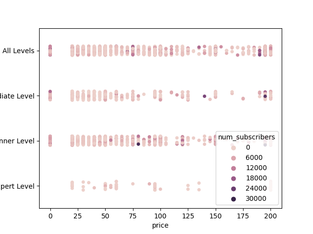
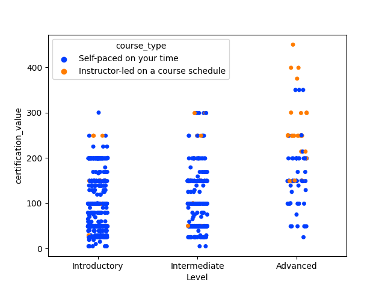
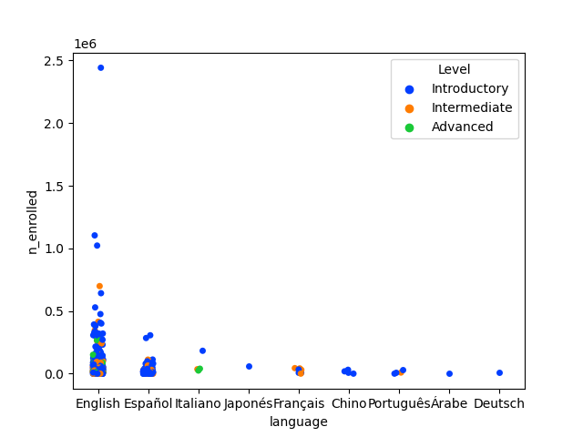

# Streamlit

La idea de este proyecto es generar la información necesaria a partir de los datos de que disponemos para hacer recomendaciones a un cliente sobre cuál es el mejor camino a tomar a la hora de tomar una decisión de negocios.

## Contexto:

Disponemos de cuatro datasets de empresas de educación digital muy conocidas. Nuestro cliente quiere comenzar a trabajar en ese rubro, pero no lo quiere hacer a ciegas, por lo que nos pide que generemos información útil a partir de esas fuentes.
Los datasets, que durante el proyecto fueron reducidos a tres, son los siguientes:

- [Dataset de Udemy](https://drive.google.com/file/d/1PFW3LeJe7C3b6WptTixbsluHDDQqDr_6/view?usp=share_link)
- [Dataset de Edx](https://drive.google.com/file/d/1qHA8ivOQAV63i1fA9aHAvDEgAYeM2Xsv/view?usp=share_link)
- [Dataset de Coursera](https://drive.google.com/file/d/1JOxfWyta1HYupBGlidjf8UDOlEAUUPhv/view?usp=share_link)

## Objetivo:

### Deducir la importancia de las variables en las ventas y aconsejar al cliente.

## Informe:
Los datos muestran claramente una relación entre el nivel del curso (información presente entre los datos de Udemy y de Edx y la cantidad de inscriptos a esos cursos. Llamativamente, el valor de los mismos no parece ser determinante a la hora de tomar la decisión de estudiar en línea.

Para que se pueda ver claramente este punto, presento dos gráficas:

Tanto en el primer gráfico como en el segundo, se nota una clara tendencia de los estudiantes hacia los cursos más generales o introductorios, independientemente, como ya mencioné, del valor de los mismos, por lo cual creo que esa es una variable a tener en cuenta. Más específicamente, en el link que compartiré al final, se pueden notar dos cosas: quienes deciden iniciar un curso de este estilo, son generalmente, quienes, en promedio, más tiempo están dispuestos a dedicarle, ya que son mayoría en los cursos de mayor duración y mayor carga horaria. Quienes necesitan cursos avanzados, en general los eligen de corta duración y baja carga horaria.

Otro factor determinante a la hora de elegir un curso, es el idioma en el que se brinda. Una abrumadora mayoría los elige en inglés. Claro que esto se debe a múltiples factores: La mayoría de los estudiantes de este tipo de cursos, especialmente durante los años analizados, son de habla inglesa; quedando el español, en un lejano segundo lugar, pero con bastante relevancia.

Aquí una muestra:

Entonces, hasta aquí tenemos algunas cuestiones a tener en cuenta: 
1. Se prefieren cursos generales o de nivel inicial
2. El idioma en que se dicta el curso
3. La carga horaria y la duración.

No hay que olvidar que esto lleva también sus desventajas. La cantidad de estudiantes puede ser muy grande, pero también lo es el índice de desersión, como se muestra en este estudio:
[Online Education Statistics for creators and entrepreneurs](https://elitecontentmarketer.com/online-education-stats/)

