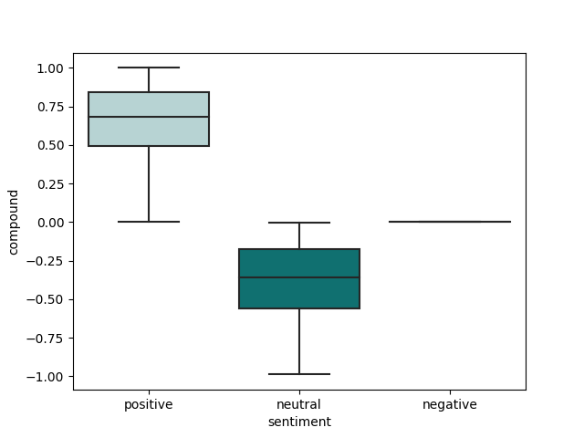
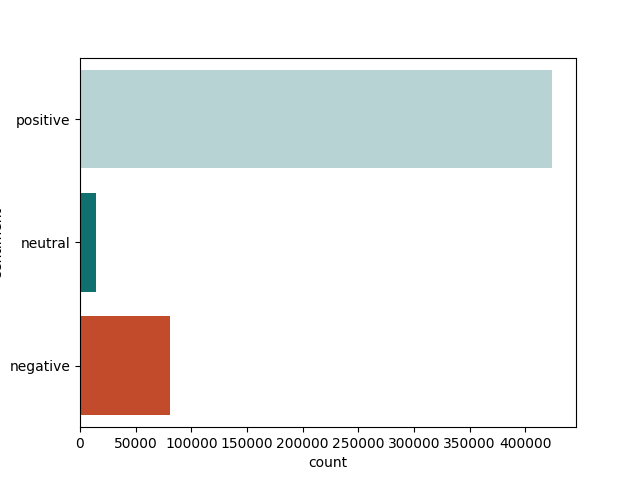
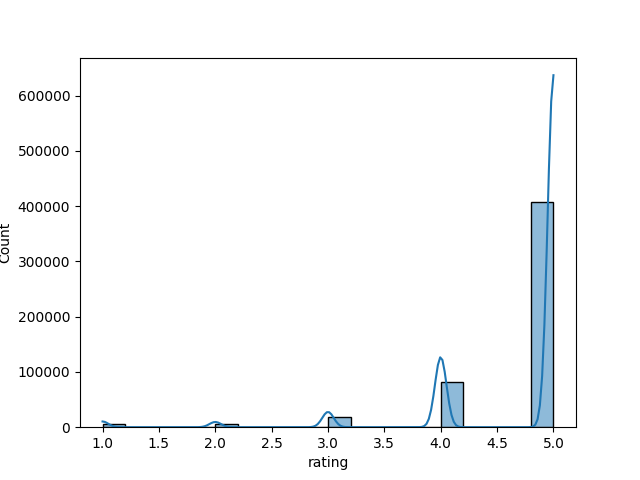

# Streamlit

La idea de este proyecto es generar la información necesaria a partir de los datos de que disponemos para hacer recomendaciones a un cliente sobre cuál es el mejor camino a tomar a la hora de tomar una decisión de negocios.

## Contexto:

Disponemos de cuatro datasets de empresas de educación digital muy conocidas. Nuestro cliente quiere comenzar a trabajar en ese rubro, pero no lo quiere hacer a ciegas, por lo que nos pide que generemos información útil a partir de esas fuentes.
Los datasets, que durante el proyecto fueron reducidos a tres, son los siguientes:

- [Dataset de Udemy](https://drive.google.com/file/d/1PFW3LeJe7C3b6WptTixbsluHDDQqDr_6/view?usp=share_link)
- [Dataset de Edx](https://drive.google.com/file/d/1qHA8ivOQAV63i1fA9aHAvDEgAYeM2Xsv/view?usp=share_link)
- [Dataset de Coursera](https://drive.google.com/file/d/1JOxfWyta1HYupBGlidjf8UDOlEAUUPhv/view?usp=share_link)

## Objetivo:

### Deducir la importancia de las variables en las ventas y aconsejar al cliente.

## Informe:
Los datos muestran claramente una relación entre el nivel del curso (información presente entre los datos de Udemy y de Edx y la cantidad de inscriptos a esos cursos. Llamativamente, el valor de los mismos no parece ser determinante a la hora de tomar la decisión de estudiar en línea.

Para que se pueda ver claramente este punto, presento dos gráficas:

Tanto en el primer gráfico como en el segundo, se nota una clara tendencia de los estudiantes hacia los cursos más generales o introductorios, independientemente, como ya mencioné, del valor de los mismos, por lo cual creo que esa es una variable a tener en cuenta. Más específicamente, en el link que compartiré al final, se pueden notar dos cosas: quienes deciden iniciar un curso de este estilo, son generalmente, quienes, en promedio, más tiempo están dispuestos a dedicarle, ya que son mayoría en los cursos de mayor duración y mayor carga horaria. Quienes necesitan cursos avanzados, en general los eligen de corta duración y baja carga horaria.

Otro factor determinante a la hora de elegir un curso, es el idioma en el que se brinda. Una abrumadora mayoría los elige en inglés. Claro que esto se debe a múltiples factores: La mayoría de los estudiantes de este tipo de cursos, especialmente durante los años analizados, son de habla inglesa; quedando el español, en un lejano segundo lugar, pero con bastante relevancia.

Aquí una muestra:

Entonces, hasta aquí tenemos algunas cuestiones a tener en cuenta: 
1. Se prefieren cursos generales o de nivel inicial
2. El idioma en que se dicta el curso
3. La carga horaria y la duración.
4. La modalidad preferida es la libre, antes que la estructurada.

No hay que olvidar que esto lleva también sus desventajas. La cantidad de estudiantes puede ser muy grande, pero también lo es el índice de desersión, como se muestra en este estudio:
[Online Education Statistics for creators and entrepreneurs](https://elitecontentmarketer.com/online-education-stats/)

Ahora es momento de introducir otra variable: el rating. Ya que nuestro trabajo se desarrolla en internet, es ahí también donde tenemos que ir a buscar el feedback. ¿Cuánto influye una mala calificación? ¿contamos con herramientas para hacer esta medición?
Afortunadamente, la respuesta a la última pregunta es sí.

**¿Es lo mismo una review por click que una review escrita?**
Primero tenemos que saber que una es mucho más fácil de medir que la otra. Pero también es más imprecisa. ¿cuál es el criterio para poner 4 estrellas en lugar de 5 o 3? ¿qué faltó? Imposible saberlo. Por eso podemos complementar esa medición con, por ejemplo, un análisis de sentimiento. A continuación algunos ejemplos:

Ahí estamos midiendo la proporción de aspectos positivos, negativos y neutros y clasificando las opiniones de esa manera. No es un método infalible, desde ya y se registran inconcistencias entre la puntuación y el sentimiento, llegando en algunos casos, a indicar lo contrario entre sí. Habría que analizar en qué momento se realizó cada una, la posible existencia de sarcasmo o ironía en la opinión escrita, etcétera, pero aún haciendo un análisis superficial sirve como complemeto y le da más profundidad a los datos. 

En los dos siguientes gráficos se nota claramente la correlación entre las dos formas de medir el rating

Antes de pasar a las conlusiones, hay una cuestión muy importante. Definir los KPI's.

Yo propongo hacer el seguimiento de este emprendimiento con tres métricas fundamentales. Por un lado, la **cantidad de alumnos**, pero eso no alcanza, porque, como hemos visto, y se detalla en la presentación, más cantidad de alumnos no implica necesariamente mayor cantidad de ingresos y vicversa. Por lo que hay que complementar esa métrica con los **ingresos** obtenidos. Así podremos tener una idea mucho más clara del rumbo a seguir. Por último, el **ingreso promedio por alumno** nos permite determinar si un curso es rentable, y, en caso de tener que tomar la determinación de abrir o cerrar un curso, ver cuál es el que más nos conviene. Además, estas métricas nos van a permitir calcular con mayor precisión el ROI, cuando dispongamos de las métricas de inversión. 

Por último, las conclusiones:

Los datos a los que les temenos que prestar mayor atención son:
- El nivel del curso, siendo preferible, tanto por ingresos como por cantidad de estudiantes, el nivel introductorio y los cursos generales.
- El idioma es un factor clave a la hora de poder escalar el negocio hacia los mercados más grandes y con mayor poder adquisitivo. El curso debe, al menos, tener subtítulos en inglés.
- La duración y la carga horaria del curso. Es preferible que sean cursos cortos y con horarios flexibles o sin un cronograma fijo.
- No se pudo determinar una relación clara entre el rating y las ventas o la cantidad de alumnos, pero contamos con las herramientas para hacerlo.
(---)

